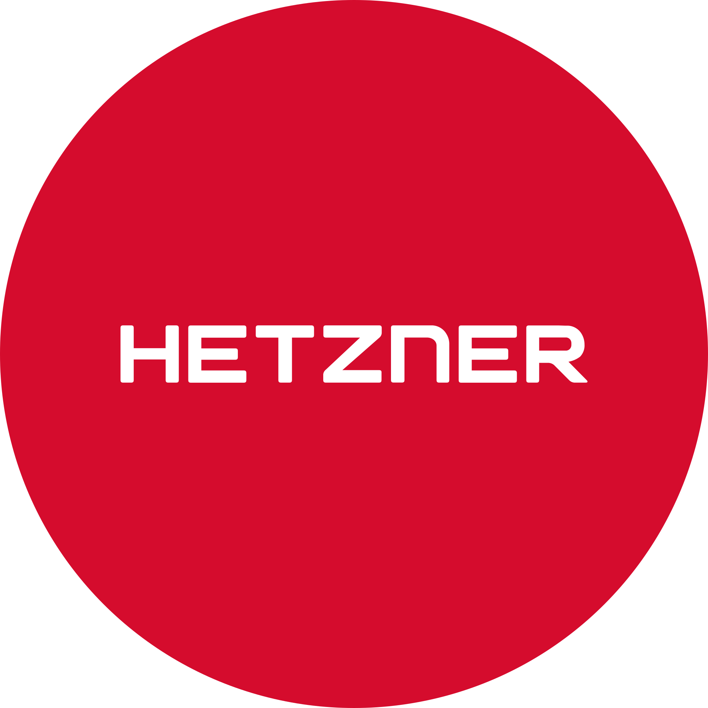

 

###

# 💫 About me:

  

###

<h2 align="left">📊 GitHub Stats: </h2>

###

  
  
  

  

###

<h2 align="left">🚀 Langs, Scripts, Plugins, Softwares, Tecnologies and Frameworks</h2>

###

<!-- Linguagens -->

  
  
  
  
  
  
  
  
  
  
  
  
  
  
  
  
  
  
  
  
  
  
  
  
  
  
  
  
  
  
  
  
  
  
  
  
  
  
  
  
  
  
  
  
  
  
  
  
  
  
  
  
  
  
  
  
  
  
  
  
  
  
  
  
  
  
  
  
  
      
  
  
  
  
  
  
  
  
  
  
  
  
  
  
  
  
  
  
  
  
  
  
  
  
  
  
  
  
  
  
  
  
    

###

<h2 align="left">🌐 Databases</h2>

###

  
  
  
  
  
  
  
  
  
  
  
  
  
  
  

###

<h2 align="left">💻 Frameworks:</h2>

###

  
    
    
  
  
  
  

###

<h2 align="left">🌐 CMS's</h2>

###

    
    
    
    
    
    
    
    
    
    
    
    
    
    

###

<h2 align="left">💻 Operating Systems:</h2>

###

    
    
    

###

<h2 align="left">✍️ IDE's and Editors:</h2>

###

  
  
  
  
  
  
    
    
    

###

<h2 align="left">🌐 Servers & VPS's:</h2>

#### Servers

  
  
  
  
  
  

#### Operating Systems

  
  
  

#### Panel Web Servers

  
  
  
  
  
  
  

###

<h2 align="left">🌐 Socials:</h2>

###

  
  
  

### 🔝 Top Contributed Repo

###

###

 

<h2 align="left">📊 Views:</h2>

